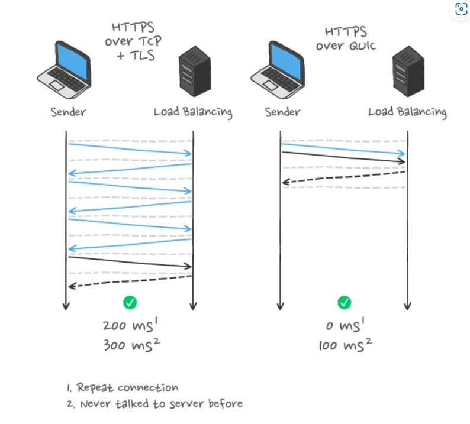
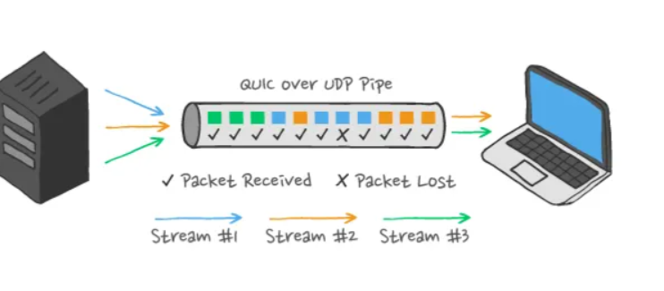

**http 3**

HTTP/3 aims to enable fast, reliable, and secure web connections across all types of devices by resolving HTTP/2's transport-related problems. To do this, it employs a separate transport layer network protocol known as QUIC (Quick UDP Internet Connections), which operates on the User Datagram Protocol (UDP) internet than the TCP used by all prior versions of HTTP. 

**QUIC(Quick UDP Internet Connections)** is also supposed to be extremely quick because it uses 0-RTT and 1-RTT (Round Trip Time) handshakes instead of TCP 3-way handshakes. QUIC ensures faster and more accurate data transmission. 

Traditional web traffic uses TCP, which is reliable but has several limitations like slow connection setups and blocking issues when packets are lost. QUIC fixes these by using UDP as its base and adding advanced features on top of it. QUIC improves how data travels over the internet. With HTTP/2 over TCP, if one small packet is delayed or lost, all other data has to wait — this is called head-of-line blocking. But with QUIC, each stream of data is independent, so others continue flowing smoothly even if one faces an issue.

| Benefit            | Simple Explanation                                                        |
|--------------------|----------------------------------------------------------------------------|
| Faster Connections | QUIC connects quicker, with fewer handshakes (0-RTT).                      |
| No Blocking        | One slow message won’t block others (no head-of-line blocking).           |
| Always Secure      | QUIC always encrypts your data using TLS 1.3.                              |
| Mobile Friendly    | Can switch networks (e.g. Wi-Fi to 4G) without disconnecting.              |
| Built for HTTP/3   | HTTP/3 was designed to run on top of QUIC.                                |

**Limitations of TCP**

* TCP can intermittently hang your data transmission : TCP's receiver sliding window does not progress if a segment with a lower sequence number hasn't arrived / been received yet, even if segments with higher number have. This can cause the TCP stream to hang momentarily or even close, even if only one segment failed to arrive. 
* TCP does not support stream level multiplexing
* TCP incurs redundant communication
 

.png>)

**Features of QUIC**

* Stream multiplexing and flow control : By using UDP, there is no packet-level Head-of-Line blocking.
* TCP has a rigid congestion control mechanism. Every time the TCP protocol detects congestion, it halves the size of the congestion window. QUIC’s congestion control is more flexible and makes more efficient use of the available network bandwidth, resulting in better traffic throughput.
* Better error handling
* Faster handshaking : Setting up a secure connection with TCP and TLS takes at least two Round-Trip Times (RTTs), adding to the latency overhead. With QUIC, setting up the first encrypted connection is 1 RTT, and when the session is resumed, payload data is sent with the first packet, for a minimum of zero RTTs, offering a consistent across the board reduction in overall latency when compared to HTTP/2.

